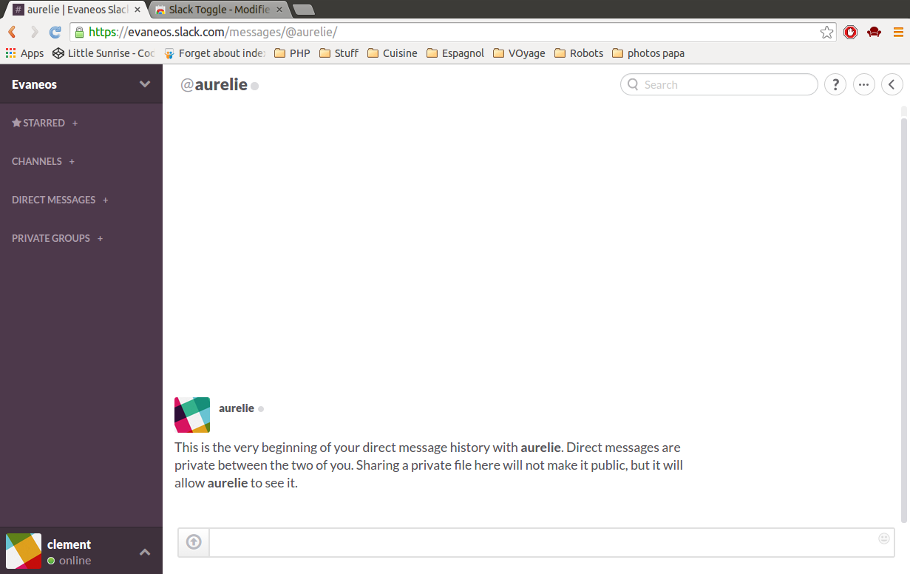

# Slack Toggle

This Chrome extension allows you to collapse some channels in Slack, so that you can hide your starred discussions, the channels, the direct messages or the private groups if you don't want them to eat up too much space. 

This extension is available on [the chrome web store](https://chrome.google.com/webstore/detail/slack-toggle/ddcippobpbmaanbnaeapbelmjopbahli)

## Installation for using the extension

Go to the chrome web store and install the [latest published version](https://chrome.google.com/webstore/detail/slack-toggle/ddcippobpbmaanbnaeapbelmjopbahli)

## Installation for development

Pull requests are welcome, but in order to develop an extension, you need to register it as a developper extension.

 - Clone or download this repository
 - Open a tab to chrome://extensions/
 - Tick the "developper mode" checkbox
 - Click "Load unpackaged extension".
 - Navigate to the directory where this repository is located.
 - Open Slack and voila !

## Usage

Just click the +/- buttons next to the section title to collapse or expand a section. I know, the button is tiny so don't miss !
